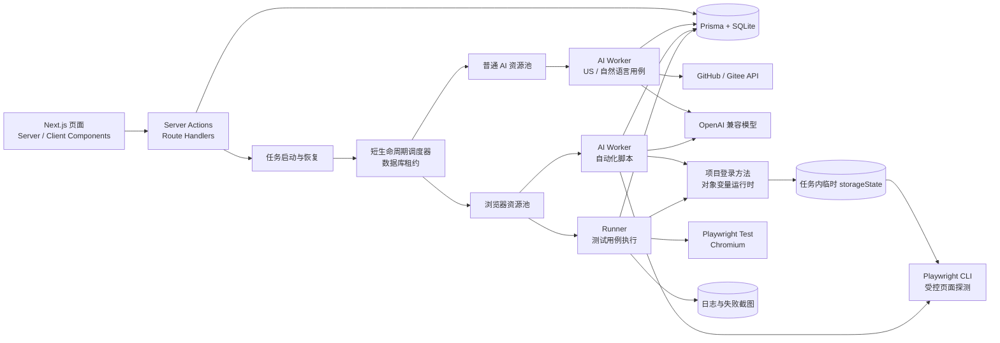
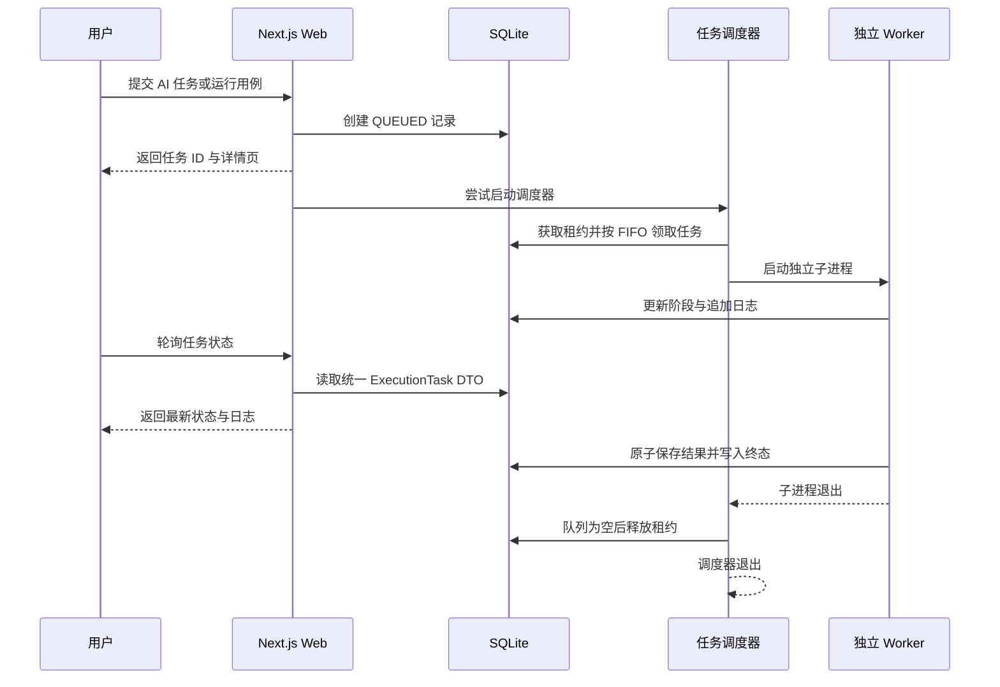

# SpecChain

SpecChain 是面向内部团队的需求与测试工程平台，覆盖 Feature、用户故事、自然语言测试用例、AI 辅助生成、Playwright 自动化脚本和执行任务。系统只支持桌面端，建议浏览器宽度不低于 1280 像素。

核心能力：

- 使用 `As / I want / so that` 和 `Given / When / Then` 管理结构化需求。
- 一个 US 可以关联多条测试用例；测试用例也可以不关联 US。
- AI 可分别生成待评审 US、待评审自然语言测试用例和正式自动化脚本。
- 自动化脚本生成通过受控 Playwright CLI 会话探测真实页面。
- 每个项目可维护一份公共登录方法，并用对象变量复用不同账号，自动化脚本无需重复生成登录流程。
- 所有 AI 任务和测试执行统一进入“执行任务”，支持并发隔离、实时日志、停止、失败截图和历史记录。
- 项目变量可按需开启 AES-256-GCM 加密；仓库 PAT 和模型 API Key 始终加密保存。

需要系统理解启动过程、数据关系、AI 工作流、任务调度、页面探测、测试执行、安全边界及源码阅读顺序时，请阅读 [代码架构与运行机制](docs/代码架构与运行机制.md)。

## 代码启动

### 环境基线

| 分类       | 版本或方案                                      |
| ---------- | ----------------------------------------------- |
| 运行环境   | Node.js 22.22.0、npm 11.11.1                    |
| Web        | Next.js 16.2.12、React 19.2.8、TypeScript 6.0.3 |
| 界面       | Shadcn/ui（Base UI + Nova）、Tailwind CSS 4     |
| 表单与表格 | React Hook Form、TanStack Table                 |
| 数据       | Prisma 7.9、SQLite、better-sqlite3 适配器       |
| AI         | Vercel AI SDK 7、OpenAI 兼容模型适配器          |
| 自动化     | Playwright Test 1.62、Playwright CLI、Chromium  |
| 测试       | Vitest 4、Playwright Test                       |
| 工程质量   | ESLint 9、Prettier 3、Pino                      |

完整依赖版本由 `package-lock.json` 锁定。Windows 本地开发建议使用 nvm-windows：

```powershell
nvm install 22.22.0
nvm use 22.22.0
node --version
npm --version
```

### 本地开发

1. 复制环境变量模板：

   ```powershell
   Copy-Item .env.example .env
   ```

2. 生成 32 字节加密密钥：

   ```powershell
   node -e "console.log(require('node:crypto').randomBytes(32).toString('base64'))"
   ```

3. 编辑 `.env`：

   - 将随机值填入 `APP_ENCRYPTION_KEY`。
   - 将 `ADMIN_PASSWORD` 改为至少 8 位的安全密码。
   - 本地 HTTP 环境保持 `SESSION_COOKIE_SECURE="false"`。
   - `AI_TASK_CONCURRENCY` 和 `BROWSER_TASK_CONCURRENCY` 默认均为 `2`，可按机器资源设置为 `1～16`。

4. 安装依赖并启动：

   ```powershell
   npm ci
   npm run dev
   ```

`npm ci` 会通过项目的 `postinstall` 自动安装固定 Playwright 版本对应的 Chromium。Playwright Test 与 Playwright CLI 共用这一份浏览器，不依赖全局 npm 包或人工安装。访问 [http://localhost:3000](http://localhost:3000)。`npm run dev` 会先应用已有 Prisma migration 并初始化管理员；管理员已存在时不会重置其密码。

`APP_ENCRYPTION_KEY` 与已开启加密的项目变量、仓库 PAT 和模型 API Key 绑定。数据库中已有加密数据后不要直接更换该密钥。

### 生产启动与容器

本机 Node 方式：

```powershell
npm ci
npm run build
npm run start
```

单容器方式：

```powershell
Copy-Item .env.example .env
# 修改 .env 中的管理员密码和加密密钥
docker compose up --build -d
docker compose ps
```

容器内只有一个 Next.js Node 服务和 Chromium。SQLite、运行日志及失败截图位于持久化卷 `specchain-data`。生产环境应通过 HTTPS 反向代理访问，并设置：

```dotenv
SESSION_COOKIE_SECURE="true"
```

如需调整宿主机端口，可设置 `SPECCHAIN_PORT`。完整备份、升级和部署边界见 [部署说明](docs/部署说明.md)。

项目不支持普通 Serverless，也不应启动多个共享同一 SQLite 文件的应用实例。

### 常用命令

| 命令                      | 用途                                       |
| ------------------------- | ------------------------------------------ |
| `npm run dev`             | 应用 migration、初始化管理员并启动开发服务 |
| `npm run build`           | 生成 Prisma Client 并构建生产版本          |
| `npm run start`           | 应用 migration、初始化管理员并启动生产服务 |
| `npm run db:migrate`      | 创建并应用开发环境 migration               |
| `npm run db:studio`       | 打开 Prisma Studio                         |
| `npm run format`          | 格式化代码和文档                           |
| `npm run format:check`    | 检查格式                                   |
| `npm run typecheck`       | 检查 TypeScript 类型                       |
| `npm run lint`            | 检查代码规范                               |
| `npm test`                | 运行单元测试                               |
| `npm run test:e2e`        | 使用独立数据库运行浏览器端到端测试         |
| `npm run browser:install` | 修复安装项目固定版本的 Chromium            |

推荐提交前依次执行：

```powershell
npm run format:check
npm run typecheck
npm run lint
npm test
npm run build
npm run test:e2e
```

端到端测试使用独立的 `data/e2e.db`，不会修改日常开发数据库。

如果 Windows 报告 Prisma `schema-engine-windows.exe spawn UNKNOWN`，通常是 WDAC 或智能应用控制阻止了二进制文件。应从系统安全策略层面允许项目依赖目录中的 Prisma 引擎，不要为绕过本机策略修改 Schema、migration 或业务代码。

## 代码架构

### 总体结构



Web 层只负责读取页面、校验输入、创建任务和展示状态。耗时 AI 与浏览器工作均在独立子进程中运行，不占用 Next.js 请求生命周期。

### 分层职责

```text
prisma/                 数据模型、前向 migration 和管理员初始化
scripts/                端到端测试数据库准备脚本
src/app/                页面、Server Actions 和 Route Handlers
src/components/         Shadcn/ui 基础组件与中文业务组件
src/lib/                纯领域规则、Schema、类型和展示元数据
src/server/             认证、数据库、加密、DTO 及任务启动
src/ai/                 模型适配、提示词、代码读取和结构化工作流
src/ai-worker/          单个 AI 任务的装载、分派、日志和持久化
src/automation/         页面探测工具、Agent 编排、指纹和脚本校验
src/task-scheduler/     数据库租约、FIFO 领取和双资源池容量控制
src/task-runtime/       子进程、运行环境和进程树终止能力
src/runner/             测试执行上下文、脚本补齐、运行及产物处理
tests/unit/             领域逻辑、并发策略和安全边界测试
tests/e2e/              登录、需求、用例、AI 与运行核心流程测试
```

主要边界：

- 页面读取使用 React Server Components；交互表单和动态列表保留最小 Client Component 边界。
- 普通表单和业务操作使用 Server Actions；轮询、停止、日志和截图使用 Route Handlers。
- Client 与 Server Action 共用客户端安全的 Zod Schema，服务端校验始终是最终权威。
- Prisma 只在服务端和任务子进程中使用，数据库实体不会直接透传给浏览器。
- UI 组件只负责交互与展示，任务状态转换、错误分类、输入指纹和安全校验位于领域或服务模块。

### 执行任务主流程



调度器维护两个互不占用配额的资源池：

- 普通 AI 池：生成 US、生成自然语言测试用例。
- 浏览器池：主动生成自动化脚本、测试用例执行。

每个任务拥有独立 Worker ID、AbortSignal、临时目录、日志流和浏览器会话。数据库条件更新保证只有当前 Worker 能写入终态；单个任务失败、停止或超时不会终止其他任务。

服务重启时，`instrumentation.ts` 会清理遗留 Playwright CLI 会话，将遗留运行中任务标记为失败，释放调度租约，并在存在排队任务时重新启动调度器。

### 三类 AI 工作流

| 能力           | 主要输入                                             | 外部能力                                               | 结果                         |
| -------------- | ---------------------------------------------------- | ------------------------------------------------------ | ---------------------------- |
| 生成 US        | 需求、可选 FE 上下文、相关源码                       | 仓库 API、模型结构化输出                               | 待评审 US 草稿               |
| 生成测试用例   | 一个 US 或自由需求、相关源码、已有用例分组           | 仓库 API、模型结构化输出                               | 1～20 条待评审自然语言用例   |
| 生成自动化脚本 | 正式用例、Base URL、变量元数据、自动化约束、相关源码 | 仓库 API、模型结构化输出、模型工具调用、Playwright CLI | 校验后保存的 Playwright 脚本 |

三项能力拥有独立模型绑定、Skill、提示词和任务记录。提示词集中在：

```text
src/ai/prompts/generate-user-story/
src/ai/prompts/generate-test-cases/
src/ai/prompts/generate-automation-script/
```

自动化脚本生成使用两步代码预检：`check-code.md` 按路径筛选候选源码，`verify-code.md` 读取源码后确认测试用例要求的具体行为是否确实实现；两步都通过后才启动页面探测。

Markdown 文件承载可评审的提示词正文；TypeScript 负责强类型变量注入、工具权限和结果校验。提示词行为发生实质变化时，应同步提升对应 Skill 版本。

生成 US 和自然语言测试用例通过 GitHub/Gitee 官方 API 读取同一提交下的文件树及有限相关源码，不执行 Git clone，也不向模型开放 Shell。仓库地址只支持 `github.com` 和 `gitee.com`；PAT 按仓库域名自动选择。

自动化脚本生成前会读取项目配置分支的最新代码，并使用测试用例文本定位相关源码；随后还会检查源码是否直接实现用例要求的具体行为。仅找到通用页面、路由壳或列表容器并不算实现，例如用例要求显示“创建人”而源码没有对应字段时，任务会在页面探测前失败。没有仓库、PAT、可读相关代码或直接实现证据时，任务直接失败且不启动页面探测。通过预检后，受限代码上下文会辅助模型理解入口和业务状态，但真实页面探测仍是生成脚本的最终依据。模型只看到变量名称、类型和描述；变量值保留在服务端 `toolsContext` 中。页面探测工具白名单只允许同源导航、语义快照、元素查找、稳定 locator 和必要交互，不允许 Shell、文件系统、截图、Cookie、任意 JavaScript、跨域导航或网络拦截。

### 通用项目变量与登录复用

每个项目在“项目设置 → 测试设置”中以表格维护字符串、数字和对象变量。对象只支持一层字符串或数字字段；标量和对象字段都可以独立开启 AES-256-GCM 加密。新建和编辑均在弹窗中完成，编辑加密值时留空会保留原值。自然语言用例使用两种引用：

- `${LOCALE}` 或 `${ADMIN.username}` 读取标量或对象字段。
- `${ADMIN}` 表示使用账号对象调用公共 `login(page, credentials)` 方法成功登录。账号对象必须包含字符串类型的 `username`、`password` 字段，且 `password` 开启加密；一条用例最多引用一个完整账号对象。

生成自动化脚本前，Worker 会解析用例引用。发现完整账号对象时，它在当前任务的独立目录中执行公共登录方法并生成临时 `storageState`，再让 Playwright CLI 探测已登录页面。模型只能看到变量名称、字段结构和描述，不能看到变量值、登录源码或临时状态；最终脚本通过 `./specchain/variables` 的 `getCredentials()` / `getVariable()` 读取值，并按需调用 `./specchain/login`。

`storageState`、变量助手和内部环境键映射不入库、不写日志、不跨任务缓存，任务结束即随临时目录删除。脚本指纹只包含实际引用变量的结构而不包含值；修改值或公共登录方法不会让脚本过期，修改变量名称或字段结构会标记为“需更新”。

### 测试用例执行

运行用例时：

1. Web 创建一条 `TestRun`，在统一任务页中显示为“测试用例执行”。
2. Runner 解析用例中的变量引用并读取当前值；引用或账号对象结构失效时在模型调用前失败。
3. 手工脚本直接执行；AI 脚本输入指纹未变化时复用。
4. 没有脚本或 AI 脚本已过期时，在同一任务内准备登录环境、探测页面、生成并校验脚本。
5. 脚本通过静态安全检查和 `playwright test --list` 后原子保存。
6. Runner 写入公共登录模块并只实际执行一次，不由 AI 自动修复或重复触发写操作。
7. stdout、stderr 和阶段日志脱敏后持久化；失败或超时时保存截图。

手工编辑的完整 Playwright 文件可以执行 Node.js 代码，因此首版只面向内部可信用户。独立目录不是容器级安全沙箱，不要向不可信用户开放脚本编辑或运行权限。

### 数据与安全

- 登录使用 Argon2id 密码哈希、数据库 Session 和 HttpOnly Cookie，会话有效期 7 天。
- 开启加密的项目变量、仓库 PAT 和模型 API Key 使用 AES-256-GCM，密文不进入客户端响应或日志。
- 登录凭据只从项目变量解析；临时认证状态不入库且不跨任务复用。
- 所有业务删除均为逻辑删除；密钥密文等不应保留的秘密在删除时物理清除。
- 测试执行日志和失败截图保留 30 天；任务摘要长期保留。
- AI 脚本生成和测试执行阶段分别最多 10 分钟。
- AI 脚本必须为单文件、单测试，并禁止动态执行、网络拦截、Cookie 操作、固定休眠及绕过平台超时。

### 代码约定

- 新项目只写前向 migration，不增加历史兼容、双写或旧路由跳转。
- 优先按业务职责拆分模块，不为行数指标建立无意义的抽象层。
- 中文注释只解释并发、所有权、安全和任务生命周期等非显然规则。
- 页面导航使用语义链接；业务动作使用按钮，E2E 优先按可访问角色和名称定位。
- 所有外部输入在边界处使用 Zod 校验，内部函数接收已校验的强类型数据。
- 结构化错误对用户提供中文安全信息，不记录模型原文、完整源码、PAT、API Key 或项目变量值。
