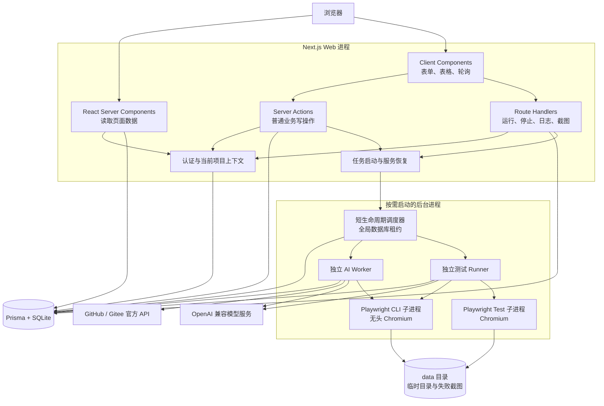
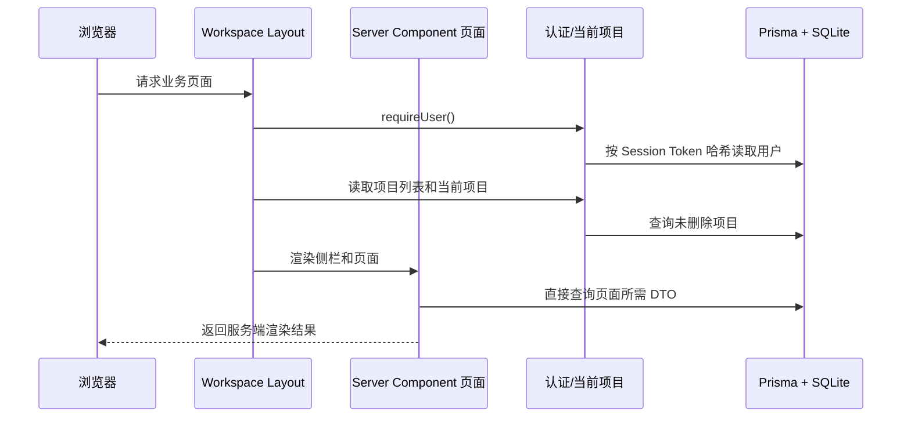
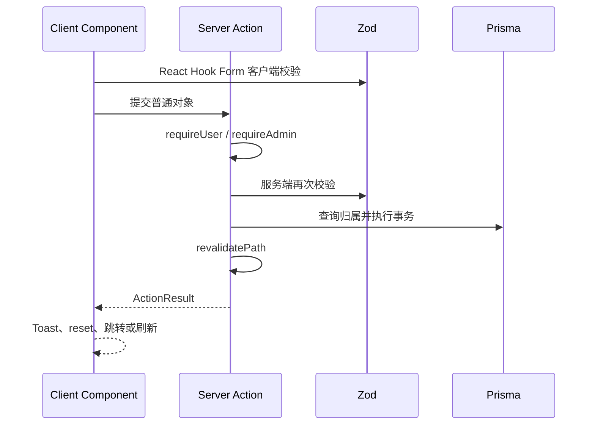
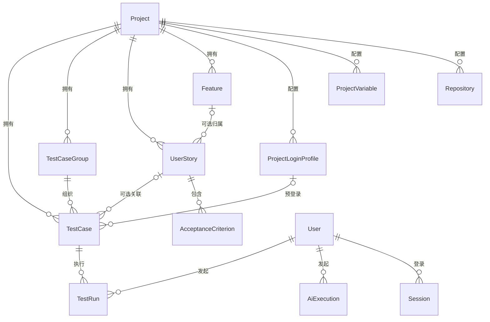
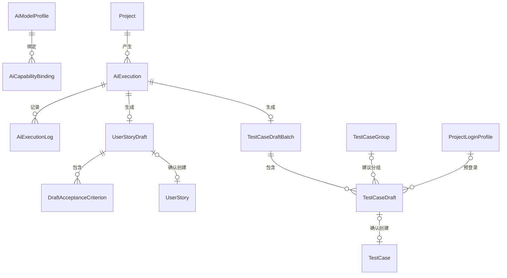
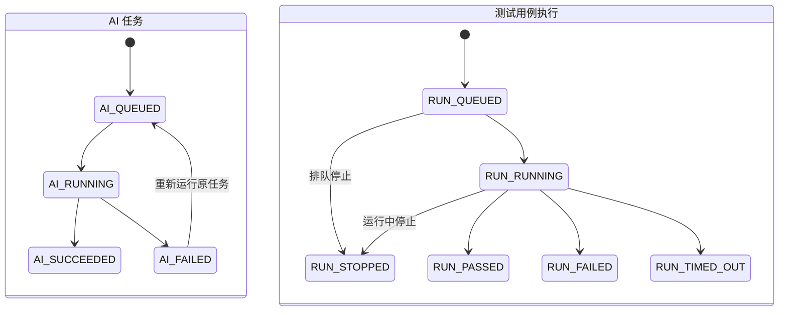
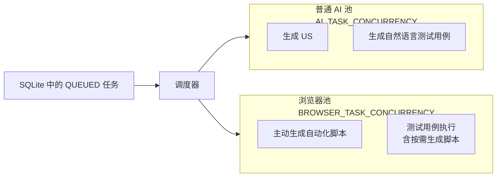
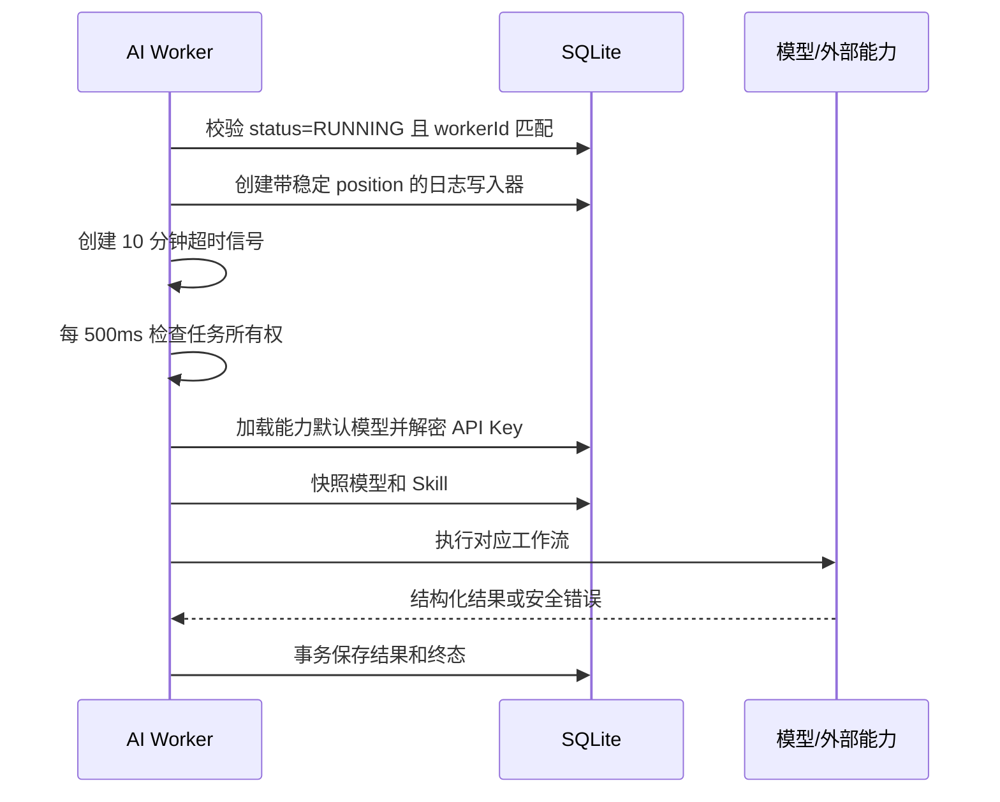
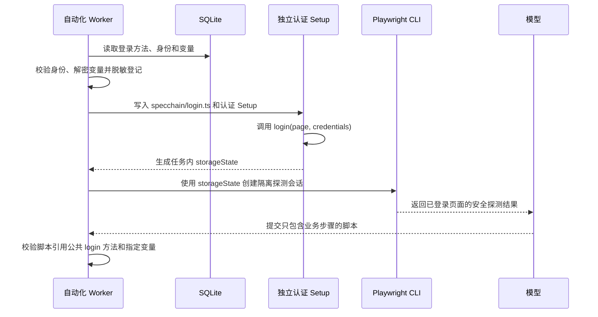
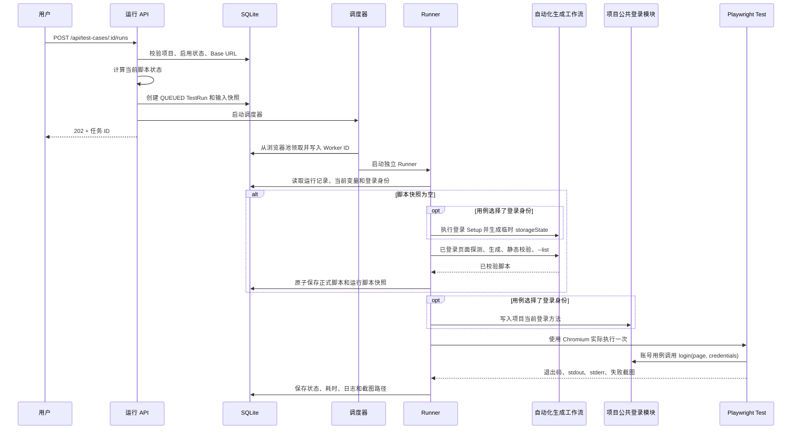

# SpecChain 代码架构与运行机制

## 1. 文档目标

本文描述当前代码真实实现，而不是未来规划。阅读完成后，应能回答以下问题：

- 项目安装依赖后发生了什么，开发和生产服务分别如何启动。
- 浏览器请求如何经过页面、Server Action、Route Handler、认证和数据库。
- FE、US、测试用例、草稿、AI 任务和测试运行之间是什么关系。
- 三类 AI 能力如何读取输入、调用模型、生成结果并进入人工评审。
- 为什么任务能并发执行，又不会因一个任务失败而终止其他任务。
- Playwright CLI 如何探测真实页面，Playwright Test 如何执行最终脚本。
- 脚本何时复用、何时过期、何时重新生成，以及并发修改如何避免覆盖。
- 日志、敏感值、截图、停止、超时、服务重启和过期清理分别如何处理。
- 修改某类功能时，应从哪些文件进入，哪些边界不能绕过。

建议按以下顺序阅读：

1. 先看“总体架构”和“启动过程”，建立运行时全貌。
2. 再看“Web 请求”“数据模型”和“权限”，理解普通业务。
3. 然后看“执行任务与调度器”，理解异步任务基础设施。
4. 最后分别看三类 AI 工作流、页面探测和测试执行。
5. 实际改代码前，再查阅“常见修改入口”和“排障指南”。

---

## 2. 系统定位与边界

SpecChain 是面向内部可信团队的需求与测试工程平台，主要管理：

- Feature（FE）与用户故事（US）。
- Given / When / Then 验收标准。
- 自然语言测试用例及其分组。
- GitHub / Gitee 仓库读取凭据。
- OpenAI 兼容模型配置。
- AI 生成的待评审 US 和待评审测试用例。
- AI 生成的 Playwright TypeScript 自动化脚本。
- Playwright 测试执行、日志和失败截图。

当前部署边界：

- 只支持宽度不低于 1280 像素的 Web PC 端。
- 使用 SQLite，因此只运行一个 Next.js 应用实例。
- 不是 Serverless 应用，运行环境必须允许写磁盘和启动子进程。
- 不提供真实 Git clone、pull、push；需求类 AI 通过托管平台 API 读取代码。
- 自动化脚本的页面探测不读取代码仓库。
- 用户手工编写的 Playwright 文件可以执行 Node.js 代码，因此系统只面向内部可信用户。
- 临时目录和独立进程提供故障隔离，不等同于容器级安全沙箱。

---

## 3. 技术栈与依赖职责

实际版本以 `package-lock.json` 为准，主要职责如下：

| 分类     | 当前方案                                    | 在代码中的职责                               |
| -------- | ------------------------------------------- | -------------------------------------------- |
| 运行时   | Node.js 22.22、npm 11.11                    | Next.js、调度器、Worker 和 Playwright 子进程 |
| Web      | Next.js 16.2、React 19.2、TypeScript 6      | 页面、Server Actions、Route Handlers         |
| UI       | Shadcn/ui Base UI Nova、Tailwind CSS 4      | 组件源码、布局和语义主题变量                 |
| 表单     | React Hook Form、Zod Resolver               | 客户端表单状态和即时校验                     |
| 表格     | TanStack Table                              | 列定义、FE 展开和通用表格渲染                |
| 动态请求 | TanStack Query                              | 执行状态、日志和运行记录轮询                 |
| 数据     | Prisma 7、SQLite、better-sqlite3 适配器     | 关系模型、迁移和事务                         |
| AI       | Vercel AI SDK 7、OpenAI Compatible Provider | 结构化输出、工具调用、Token 统计             |
| 自动化   | Playwright Test 1.62、Playwright CLI 0.1.17 | 页面探测、脚本校验和测试执行                 |
| 密码     | Argon2id                                    | 密码哈希和验证                               |
| 密文     | Node.js AES-256-GCM                         | 项目敏感变量、PAT、模型 API Key              |
| 日志     | Pino、数据库任务日志                        | 服务日志和用户可见任务日志                   |
| 测试     | Vitest、Playwright Test                     | 领域单元测试和端到端测试                     |

`@playwright/cli`、`@playwright/test` 和 `playwright` 都固定版本，页面探测与测试执行共用项目安装的同一份 Chromium，不依赖全局 npm 包。

---

## 4. 总体架构

### 4.1 逻辑分层



### 4.2 运行时进程

系统不是“一个请求启动一个容器”，而是以下结构：

1. 一个长期运行的 Next.js Node 进程接收 Web 请求。
2. 创建异步任务后，Web 尝试启动一个短生命周期调度器。
3. 多个并发启动的调度器通过 SQLite 租约竞争，只有一个成为有效调度器。
4. 调度器按资源池容量领取任务，每个任务启动一个独立 Worker 子进程。
5. Worker 需要页面探测或测试执行时，再启动项目本地 Playwright 子进程。
6. 队列和运行中任务全部结束后，调度器释放租约并退出。

这样做的目的：

- 长耗时 AI 和浏览器操作不占用 HTTP 请求生命周期。
- 每个任务有独立进程、AbortSignal、Worker ID、临时目录和浏览器会话。
- 单个任务崩溃、停止或超时，不会直接终止其他任务。
- 队列为空时没有常驻 Runner。

---

## 5. 目录职责

```text
prisma/
  schema.prisma              当前关系模型
  migrations/                只向前演进的数据库迁移
  seed.ts                    幂等初始化管理员

scripts/
  reset-e2e-database.mjs     安全重建 E2E 独立数据库

src/app/
  (auth)/                    登录页
  (workspace)/               登录后的业务页面
  actions/                   Server Actions
  api/                       Route Handlers
  layout.tsx                 根布局、全局 Toast 和 Tooltip
  globals.css                Shadcn/Tailwind 主题与必要全局样式

src/components/
  ui/                        Shadcn 生成并由项目持有的基础组件源码
  app-shell/                 侧栏、项目切换、面包屑、导航反馈
  data-table/                通用固定布局表格和分页
  layout/                    PageHeader、PageSection、FormPage 等页面骨架
  requirements/              FE、US、待评审需求
  test-cases/                用例、分组、脚本和运行记录
  execution-tasks/           统一执行任务列表、详情和终端日志
  editors/                   按需加载的 TypeScript 编辑器
  projects/                  项目基础、仓库、测试和登录设置
  ai/                        模型配置与 AI 生成表单

src/lib/
  auth/ requirements/ ...    客户端安全的 Zod Schema、纯领域规则和类型
  automation/                公共登录方法固定契约
  security/                  密码与 AES-256-GCM
  execution-tasks/           统一任务类型、状态和展示元数据

src/server/
  auth/                      Session 创建、读取和撤销
  projects/                  当前项目和仓库连接服务
  execution-tasks/           数据库实体到客户端 DTO 的转换
  tasks/                     调度器启动和服务重启恢复
  db.ts                      Web 进程 Prisma Client
  env.ts                     Web 环境变量校验

src/ai/
  model-provider.ts          OpenAI 兼容模型和结构化输出
  relevant-code.ts           相关代码定位与上下文控制
  repository-code-source.ts  GitHub/Gitee 文件树和文件读取
  *-workflow.ts              生成 US、生成测试用例工作流
  prompts/                   独立 Markdown 提示词
  skills.ts                  内置 Skill 名称、用途和版本

src/ai-worker/
  worker.ts                  单条 AI 任务入口和能力分派
  repository-task.ts         需要代码仓库的两类 AI 任务
  automation-task.ts         主动生成自动化脚本任务
  task-support.ts            日志、阶段、所有权和安全错误

src/automation/
  agent.ts                   AI SDK ToolLoopAgent
  agent-tools.ts             页面工具白名单和终止工具
  authentication.ts          登录配置校验、身份解析和临时认证状态
  playwright-cli-session.ts  项目本地 CLI 会话
  workflow.ts                探测、生成、静态校验和编译校验编排
  script-validator.ts        脚本安全规则
  fingerprint.ts             AI 脚本输入指纹
  script-status.ts           未生成、AI、手工、需更新状态

src/task-scheduler/
  scheduler.ts               租约、FIFO、容量计算和 Worker 启动
  policy.ts                  可单测的纯调度策略

src/task-runtime/
  runtime.ts                 子进程环境、独立 Prisma Client 和并发配置
  child-process.ts           子进程执行与完整进程树终止

src/runner/
  worker.ts                  单条 TestRun 入口
  generate-script.ts         运行中缺脚本时生成脚本
  run-context.ts             环境变量和停止信号
  run-execution.ts           Playwright 执行与终态落库
  run-log-writer.ts          实时日志、节流写入和脱敏
  artifacts.ts               失败截图和过期清理

src/generated/
  prisma/                    Prisma 生成代码，不应手工修改

tests/unit/                  纯规则和服务测试
tests/e2e/                   完整浏览器业务流程
```

代码中的 `@/` 指向 `src/`。

---

## 6. 安装与启动

### 6.0 环境基线

所有命令都应在仓库根目录执行。Windows 使用 nvm-windows 时：

```powershell
nvm install 22.22.0
nvm use 22.22.0
npm install --global npm@11.11.1
node --version
npm --version
```

预期主版本：

```text
Node.js v22.22.x
npm 11.11.x
```

### 6.1 环境变量

先复制模板：

```powershell
Copy-Item .env.example .env
```

环境变量含义：

| 变量                       | 必填 | 含义                                                 |
| -------------------------- | ---- | ---------------------------------------------------- |
| `DATABASE_URL`             | 是   | SQLite `file:` 地址，默认 `file:./data/specchain.db` |
| `ADMIN_USERNAME`           | 是   | 首次初始化管理员用户名                               |
| `ADMIN_PASSWORD`           | 是   | 首次初始化管理员密码，至少 8 位                      |
| `APP_ENCRYPTION_KEY`       | 是   | 32 字节随机密钥的 Base64，用于所有业务密文           |
| `SESSION_COOKIE_SECURE`    | 是   | 生产 HTTPS 环境必须为 `true`                         |
| `AI_TASK_CONCURRENCY`      | 否   | 普通 AI 任务并发数，默认 2，范围 1～16               |
| `BROWSER_TASK_CONCURRENCY` | 否   | 浏览器任务并发数，默认 2，范围 1～16                 |
| `SPECCHAIN_PORT`           | 否   | Docker Compose 暴露的宿主机端口                      |
| `LOG_LEVEL`                | 否   | Pino 服务日志级别，默认 `info`                       |

生成加密密钥：

```powershell
node -e "console.log(require('node:crypto').randomBytes(32).toString('base64'))"
```

重要规则：

- `APP_ENCRYPTION_KEY` 解密项目敏感变量、GitHub/Gitee PAT 和模型 API Key。
- 一旦数据库中已有密文，不能只更换密钥；数据库备份必须和原密钥一起保存。
- `ADMIN_PASSWORD` 只用于创建不存在的初始管理员，不会在每次启动时重置已有管理员密码。

### 6.2 `npm ci` 做了什么

```powershell
npm ci
```

执行过程：

1. npm 严格按 `package-lock.json` 安装依赖。
2. `postinstall` 执行 `prisma generate`，生成 `src/generated/prisma`。
3. `postinstall` 执行 `playwright install chromium`。
4. Playwright Test、Playwright CLI 和项目代码随后都解析这一份项目浏览器。

因此，其他开发者只要具备正确 Node/npm 版本并执行 `npm ci`，不需要全局安装 Prisma、Playwright CLI 或 Chromium。

### 6.3 开发启动

```powershell
npm run dev
```

实际脚本：

```text
prisma migrate deploy
→ prisma db seed
→ next dev
```

含义：

1. 应用仓库中已经提交的全部前向 migration。
2. 如果初始管理员不存在，则使用环境变量创建管理员。
3. 启动 Next.js 开发服务器。

本项目不在启动脚本里自动创建 migration。修改 `schema.prisma` 后，应在开发阶段显式执行：

```powershell
npm run db:migrate
```

生成并审查 migration，再提交到仓库。

### 6.4 生产启动

```powershell
npm ci
npm run build
npm run start
```

- `build` 先生成 Prisma Client，再构建 Next.js。
- `start` 仍会先执行 `migrate deploy` 和幂等 Seed，再启动生产服务。

### 6.5 Docker 构建

Dockerfile 使用三阶段构建：

1. `dependencies`：安装锁定依赖和 Chromium，浏览器目录固定为 `/ms-playwright`。
2. `build`：执行 Next.js 生产构建并移除开发依赖。
3. `runtime`：复制生产依赖、浏览器、构建结果、Prisma 文件、`src` 和 `tsconfig.json`。

运行镜像仍复制 `src` 和 `tsconfig.json`，是因为调度器和任务 Worker 使用项目依赖 `tsx` 直接启动 TypeScript 源文件；它们不是 Next.js 请求处理代码的一部分。

运行镜像还会：

- 安装 Chromium 所需的 Linux 系统依赖。
- 验证项目 Playwright 能找到 Chromium 可执行文件。
- 以非 root 的 `node` 用户运行。

Compose 额外配置：

- `init: true`，帮助正确回收子进程。
- `/app/data` 挂载为 `specchain-data` 持久化卷。
- `shm_size: 1gb`，供 Chromium 使用。
- 健康检查访问 `/login`。

完整部署步骤见 [部署说明](部署说明.md)。

### 6.6 数据目录

默认数据位于项目根目录的 `data/`：

```text
data/
  specchain.db                       SQLite 数据库
  automation/<aiExecutionId>/        主动脚本生成临时目录
  runs/<testRunId>/                  测试执行临时目录
  artifacts/<testRunId>/failure.png  长期保留期内的失败截图
```

- `automation/` 和 `runs/` 中的单任务临时目录在任务结束后删除。
- 账号用例的认证 Setup、公共登录模块和 `storageState` 位于相应任务临时目录内。
- 任务日志主要保存在 SQLite。
- 失败截图复制到 `artifacts/` 后才保留。

### 6.7 package scripts

| 命令                      | 实际用途                                      |
| ------------------------- | --------------------------------------------- |
| `npm run dev`             | 应用 migration、初始化管理员、启动开发服务    |
| `npm run build`           | 生成 Prisma Client、构建 Next.js              |
| `npm run start`           | 应用 migration、初始化管理员、启动生产服务    |
| `npm run db:migrate`      | 根据 Schema 创建并应用开发 migration          |
| `npm run db:studio`       | 打开 Prisma Studio                            |
| `npm run browser:install` | 安装项目固定 Playwright 版本的 Chromium       |
| `npm run format`          | 使用 Prettier 格式化源码和文档                |
| `npm run format:check`    | 只检查 Prettier 格式                          |
| `npm run typecheck`       | 运行严格 TypeScript 检查，不生成文件          |
| `npm run lint`            | 运行 Next.js、React 和 TypeScript ESLint 规则 |
| `npm test`                | 运行 Vitest 单元测试                          |
| `npm run test:e2e`        | 重建独立数据库并运行 Playwright E2E           |

---

## 7. Web 请求如何流转

### 7.1 页面初次读取



业务页面默认是 React Server Component，直接在服务端通过 Prisma 读取数据。只有需要交互状态、表单、浏览器 API 或轮询的部分才使用 `"use client"`。

项目没有使用一个全局 `middleware.ts` 代替全部安全检查：

- `(workspace)/layout.tsx` 保护业务页面。
- 每个 Server Action 再调用 `requireUser()` 或 `requireAdmin()`。
- 每个 Route Handler 再通过 `getAuthenticatedApiContext()` 校验登录和当前项目。

这种重复是边界校验，不是历史兼容。页面保护不能替代可独立访问的 Action 和 API 保护。

### 7.2 普通写操作

普通表单和业务动作使用 Server Actions：



客户端校验用于体验，服务端 Zod 和项目归属检查才是最终权威。

Server Action 通常返回统一 `ActionResult`：

```ts
{
  ok: boolean;
  message?: string;
  data?: T;
  fieldErrors?: Record<string, string[]>;
}
```

- `message` 用于 Toast 或页面错误。
- `data` 只返回下一步需要的最小数据，例如新实体 ID。
- `fieldErrors` 可用于精确表单反馈。
- Prisma 实体和敏感字段不直接作为 Action 返回值透传。

### 7.3 为什么动态任务使用 Route Handler

以下能力需要明确的 HTTP 语义和浏览器轮询，因此使用 Route Handler：

- 创建测试运行。
- 查询测试运行状态和日志。
- 停止测试运行。
- 下载失败截图。
- 查询统一执行任务列表和详情。

TanStack Query 只用于这类动态状态，不用于替代 Server Component 的普通页面读取。

当前轮询频率：

| 场景           | 有活动任务时的频率 |
| -------------- | ------------------ |
| 执行任务列表   | 1000 毫秒          |
| 执行任务详情   | 800 毫秒           |
| 单用例运行列表 | 1000 毫秒          |
| 单次运行详情   | 700 毫秒           |

任务进入终态后自动停止轮询。

---

## 8. 认证、会话与权限

### 8.1 登录

登录流程位于 `src/app/actions/auth.ts`：

1. Zod 校验用户名和密码非空。
2. 按用户名查询用户。
3. 使用 Argon2id 验证密码。
4. 用户不存在时仍验证一个预先生成的占位哈希，降低通过响应时间枚举用户名的风险。
5. 成功后创建数据库 Session 和 Cookie。

Argon2id 参数位于 `src/lib/security/password.ts`：

- memory cost：19456
- time cost：2
- parallelism：1
- 输出长度：32

### 8.2 Session

Session 机制位于 `src/server/auth/session.ts`：

1. 服务端生成 32 字节随机令牌。
2. 浏览器 Cookie 保存原始令牌。
3. 数据库只保存令牌的 SHA-256 哈希。
4. 会话有效期为 7 天。

Cookie 属性：

- 名称：`specchain_session`
- `HttpOnly`
- `SameSite=Lax`
- `Path=/`
- `Priority=High`
- 是否 `Secure` 由 `SESSION_COOKIE_SECURE` 控制

读取会话时还会确认：

- Session 存在。
- 未超过过期时间。
- 用户未被逻辑删除。

`getCurrentUser()` 使用 React `cache`，只避免同一次服务端渲染链路重复查询，不是跨请求的全局用户缓存。

### 8.3 会话失效

以下操作会撤销目标用户全部 Session：

- 用户本人修改密码。
- 管理员重置密码。
- 管理员修改用户名或角色。
- 管理员删除用户。

本人改密后会删除当前 Cookie，并要求重新登录。

### 8.4 权限

系统没有项目成员表。所有已登录用户共享全部未删除项目和业务数据。

管理员专属能力：

- 用户管理。
- 模型配置和三项 AI 能力的默认模型绑定。

用户保护规则：

- 不能删除当前登录用户。
- 不能删除最后一名管理员。
- 不能把最后一名管理员降级为普通用户。

---

## 9. 当前项目上下文

当前项目 Cookie 名称为 `specchain_project`。

选择逻辑：

1. 读取所有未删除项目，按最近更新时间倒序。
2. 如果 Cookie 指向有效项目，使用该项目。
3. 否则使用列表中的第一个项目。
4. 如果没有项目，返回 `null`，页面显示“请先创建项目”状态。

项目切换：

- 校验目标项目存在且未删除。
- 更新 HttpOnly 项目 Cookie。
- 重新验证根布局。
- 前端导航到需求列表。

所有按项目归属的 Action 和 API 都必须再次把 `projectId` 放入数据库查询条件，不能只相信客户端传来的实体 ID。

---

## 10. 前端架构

### 10.1 应用外壳

`src/components/app-shell/app-shell.tsx` 负责：

- Shadcn Sidebar。
- 当前项目切换器。
- 需求、执行任务、测试用例和项目设置菜单。
- 管理员可见的模型配置和用户管理。
- 用户菜单、修改密码和退出。
- 桌面布局与表格页滚动策略。

全局页面高度使用 `100dvh`，`html/body` 不滚动。表格页把剩余高度交给表格内部滚动，普通详情页只滚动右侧内容区域。

### 10.2 导航反馈与未保存提示

`NavigationFeedbackProvider` 捕获站内普通链接：

- 跳转开始后显示顶部细进度条和右上角加载提示。
- 不拦截新标签、下载、外链、API 或修饰键点击。
- 跳转前调用未保存检查。

`useUnsavedChanges` 同时处理：

- 浏览器刷新或关闭页签时的 `beforeunload`。
- SpecChain 内部导航时的确认框。

表单保存成功后调用 React Hook Form `reset`，以新值重新建立“已保存基线”。

### 10.3 页面骨架

公共页面组件：

- `PageContainer`：最大宽度 1600 像素，表格页可占满剩余高度。
- `PageHeader`：标题、说明、元信息和右侧操作。
- `PageSection`：统一业务区块。
- `FormPage`：表单页标题和顶部保存操作。
- `DataTableShell`：工具栏、滚动表体和底部分页。
- `DataTable`：TanStack Table 渲染。

表格采用固定布局：

- 第一个非操作列吸收剩余宽度。
- 其他列使用列定义中的稳定宽度。
- 长内容截断，不允许某一条数据挤压其他列。
- 低优先级列可按桌面宽度隐藏。
- 操作列保持刚好容纳操作的固定宽度。

### 10.4 表单

典型表单结构：

- React Hook Form 管理状态。
- `@hookform/resolvers/zod` 提供客户端校验。
- 客户端和 Server Action 共用 `src/lib/**/schema.ts` 中的安全 Schema。
- 动态验收标准、仓库和变量使用 `useFieldArray`。
- 提交使用 `useTransition`，避免阻塞交互。
- 服务端失败通过右上角 Toast 展示。

### 10.5 Markdown 与脚本

- FE 背景、US 规则等富文本使用 Markdown。
- 预览由 `react-markdown + remark-gfm + rehype-sanitize` 渲染。
- 自然语言测试步骤是普通文本，不解析 Markdown。
- Playwright TypeScript 使用按需加载的 CodeMirror，避免把编辑器加入无关页面首屏。

### 10.6 主要页面路由

| 路由                               | 用途                       |
| ---------------------------------- | -------------------------- |
| `/login`                           | 登录                       |
| `/requirements`                    | FE 和 US 统一列表          |
| `/features/new`                    | 新建 FE                    |
| `/features/[id]`                   | FE 详情                    |
| `/user-stories/new`                | 新建无 FE 归属的 US        |
| `/features/[id]/user-stories/new`  | 在 FE 下新建 US            |
| `/user-stories/ai-generate`        | AI 生成 US                 |
| `/requirements/pending-review`     | 待评审 US 草稿             |
| `/test-cases`                      | 正式测试用例列表           |
| `/test-cases/ai-generate`          | AI 生成自然语言测试用例    |
| `/test-cases/pending-review`       | 待评审测试用例             |
| `/test-case-groups`                | 分组管理                   |
| `/test-cases/[id]/runs`            | 单用例执行记录             |
| `/execution-tasks`                 | 全项目统一任务列表         |
| `/project-settings`                | 项目基础设置               |
| `/project-settings/repositories`   | PAT 和代码仓库             |
| `/project-settings/testing`        | Base URL、变量和自动化约束 |
| `/project-settings/authentication` | 公共登录方法和账号身份     |
| `/projects`                        | 项目管理                   |
| `/ai-settings`                     | 管理员模型配置             |
| `/users`                           | 管理员用户管理             |

---

## 11. Prisma 与数据库连接

### 11.1 Prisma Client

Web 进程的入口是 `src/server/db.ts`：

- 使用 `@prisma/adapter-better-sqlite3`。
- 开发环境把 Prisma Client 放入 `globalThis`，避免 Next.js 热更新重复创建连接。
- 生产环境直接创建单例。

任务调度器和 Worker 不导入 Web 专用的 `server-only` 数据库模块，而是在 `src/task-runtime/runtime.ts` 中创建自己的 Prisma Client。这保证独立 Node 子进程可以直接运行。

### 11.2 为什么只允许单应用实例

SQLite 文件和当前调度租约都位于本机持久化目录。当前架构的并发控制面向：

- 同一个应用实例内可能重复启动的调度器。
- 同一 SQLite 文件上的任务 Worker。

它不用于多个容器共享网络文件系统，也没有实现面向横向扩容的分布式数据库协调。因此生产环境必须保持一个应用容器。

---

## 12. 数据模型

除业务编号外，主要实体内部主键都由 Prisma `cuid()` 生成。页面展示的任务 ID，就是对应 `AiExecution.id` 或 `TestRun.id`，不是另行拼接的显示编号。

### 12.1 业务关系



关键关系：

- 一个 FE 可以包含多个 US。
- 一个 US 最多归属一个 FE，也可以独立存在。
- 一个 US 有一到多条有效验收标准。
- 一个 US 可以关联零到多条测试用例。
- 一条测试用例最多关联一个 US，也可以不关联。
- 测试用例必须属于一个有效分组。
- 一条测试用例最多选择一个项目登录身份，也可以不预登录。
- 登录身份只引用本项目变量；密码变量必须为敏感变量。
- 测试用例可以有多次 `TestRun`。

### 12.2 AI 与草稿关系



- `AiCapabilityBinding.capability` 是主键，所以每种 AI 能力只有一个全局默认模型。
- 一个生成 US 的任务最多产生一条 `UserStoryDraft`。
- 一个生成测试用例的任务产生一个批次，批次包含多条独立草稿。
- 每条测试用例草稿可独立确认或删除。
- 主动生成自动化脚本的任务不产生草稿，校验成功后直接更新正式用例脚本。

### 12.3 模型职责速查

| 模型                       | 关键内容与职责                                                      |
| -------------------------- | ------------------------------------------------------------------- |
| `User`                     | 用户名、Argon2id 哈希、管理员/成员角色、逻辑删除                    |
| `Session`                  | Session Token 哈希、用户和过期时间                                  |
| `Project`                  | 名称、描述、Base URL、自动化约束、公共登录源码、两类 PAT 密文和账号 |
| `Repository`               | 项目下 Git URL、分支和显示顺序                                      |
| `ProjectVariable`          | 名称、值或密文、描述、普通/敏感类型和顺序                           |
| `ProjectLoginProfile`      | 登录身份名称以及用户名、密码项目变量映射                            |
| `Feature`                  | FE 编号、名称、描述、背景与目标                                     |
| `UserStory`                | US 编号、三段式故事、状态、补充约束和可选 FE                        |
| `AcceptanceCriterion`      | Given、When、Then 和顺序                                            |
| `TestCaseGroup`            | 项目内平级用例分组                                                  |
| `TestCase`                 | TC 编号、唯一可选 US、登录身份、分组、自然语言内容、脚本及来源      |
| `TestRun`                  | 测试运行状态、阶段、快照、日志、截图、Token、取消与产物过期         |
| `BusinessCodeSequence`     | FE/US/TC 各自最后保留的毫秒时间戳                                   |
| `AiModelProfile`           | 全局模型名称、Base URL、模型 ID、API Key 密文和检查状态             |
| `AiCapabilityBinding`      | 每项 AI 能力对应的全局默认模型                                      |
| `AiExecution`              | AI 任务输入、状态、阶段、快照、Token、错误和 Worker 所有权          |
| `AiExecutionLog`           | AI 任务的结构化阶段日志                                             |
| `UserStoryDraft`           | 待评审 US 和确认后的正式 US 关联                                    |
| `DraftAcceptanceCriterion` | 待评审 US 的 Given/When/Then                                        |
| `TestCaseDraftBatch`       | 一次测试用例生成任务的草稿集合                                      |
| `TestCaseDraft`            | 可独立评审并选择登录身份的单条测试用例草稿                          |
| `TaskSchedulerLease`       | 当前有效调度器 owner 和租约过期时间                                 |

### 12.4 主要枚举

| 枚举         | 值                                                              |
| ------------ | --------------------------------------------------------------- |
| 用户角色     | `ADMIN`、`MEMBER`                                               |
| US 状态      | `DESIGN`、`DEVELOPMENT`、`TESTING`、`COMPLETED`                 |
| 测试优先级   | `P0`、`P1`、`P2`                                                |
| 测试运行状态 | `QUEUED`、`RUNNING`、`PASSED`、`FAILED`、`TIMED_OUT`、`STOPPED` |
| AI 能力      | 生成 US、生成测试用例、生成自动化脚本                           |
| AI 任务状态  | `QUEUED`、`RUNNING`、`SUCCEEDED`、`FAILED`                      |
| 草稿状态     | `PENDING`、`CONFIRMED`                                          |
| 脚本来源     | `MANUAL`、`AI`                                                  |

### 12.5 逻辑删除

业务实体普遍使用 `deletedAt`：

- 删除操作设置时间，不物理删除主要业务记录。
- 默认查询必须显式加 `deletedAt: null`。
- Prisma 关系普遍使用 `onDelete: Restrict`，避免误用物理删除造成级联丢失。
- 当前产品不提供恢复功能。

例外：

- Session 失效时物理删除。
- PAT 删除时清空密文和账号。
- 模型档案逻辑删除时清空 API Key 密文。

关系删除规则：

- 删除 FE：逻辑删除 FE，并逻辑删除其当前有效 US。
- 删除 FE 或 US：不会删除已经关联的测试用例。
- 删除 US：验收标准和关联关系仍保留，但正常页面不再展示该 US。
- 删除测试用例：保留运行历史；若仍有排队或运行中的测试任务/脚本生成任务，则拒绝删除。
- 删除分组：存在有效正式用例时拒绝；待评审用例若引用了后来删除的分组，会按“未分组”处理。
- 删除登录身份：被有效正式用例或待评审用例引用时拒绝。
- 删除项目变量：被登录身份引用时拒绝；密码变量被引用时不能改为普通变量。
- 删除项目：当前保护条件是项目中不存在有效 FE、US 或测试用例；PAT 与登录方法同时清空，登录身份同步逻辑删除。

### 12.6 业务编号

`BusinessCodeSequence` 为 FE、US、TC 各维护一个最后时间戳。

生成流程：

1. 读取当前 Unix 毫秒时间。
2. 如果不大于已保留值，则使用“上一次 + 1 毫秒”。
3. 在事务中更新序列。
4. 按上海时区格式化为 `YYYYMMDDHHmmssSSS`。

示例：

```text
FE-20260731143012123
US-20260731143012124
TC-20260731143012125
```

因此同一毫秒冲突时会顺延，删除后不会复用。

### 12.7 FE 状态

FE 不存储状态。页面读取所有有效子 US 后调用 `deriveFeatureStatus()`：

- 无子 US：设计。
- 有子 US：取进度最慢的阶段。
- 顺序：设计 → 开发 → 测试 → 完成。

这样不会产生 FE 状态与子 US 状态不一致的数据。

---

## 13. 项目设置、凭据和仓库

### 13.1 测试设置

每个项目配置：

- 可选 Base URL。
- 项目自动化约束。
- 普通或敏感项目变量。

变量运行时通过 `process.env` 注入，另有固定的 `BASE_URL`。

敏感变量规则：

- 数据库 `value` 字段保存 AES-256-GCM 密文。
- 页面只接收空字符串作为“已配置但不回显”。
- 编辑时留空且类型不变表示保留旧值。
- 新增变量或切换变量类型时必须重新填写值。

### 13.2 登录配置

每个项目可以维护一份公共 Playwright TypeScript 登录方法和多个登录身份。

登录方法使用固定接口：

```ts
import { expect, type Page } from "@playwright/test";

export type LoginCredentials = {
  username: string;
  password: string;
};

export async function login(
  page: Page,
  credentials: LoginCredentials,
): Promise<void> {
  // 项目自己的同源页面登录实现
}
```

保存边界：

- 只能导入 `@playwright/test`，不得读取 `process.env`。
- 凭据必须由调用者通过 `credentials` 传入。
- 禁止动态执行、网络拦截、Cookie 注入、绝对 HTTP(S) 地址和额外模块。
- 先做固定契约与禁止能力检查，再通过 `playwright test --list` 做 TypeScript 编译和测试发现检查。
- 保存检查不会启动浏览器，也不会执行真实登录。

登录身份只保存：

- 当前项目内唯一的身份名称。
- 一个用户名项目变量引用；变量可以为普通或敏感类型。
- 一个密码项目变量引用；变量必须为敏感类型。

用户名和密码不会复制到登录身份表。页面不会回显变量值，模型也不会收到变量值。正式测试用例和待评审用例分别通过可空 `loginProfileId` 选择一个身份；空值代表“不预登录”。

### 13.3 AES-256-GCM

密文格式：

```text
v1:<base64url iv>:<base64url auth tag>:<base64url ciphertext>
```

- IV 长度 12 字节。
- GCM Auth Tag 用于验证密文完整性。
- 加密密钥必须正好 32 字节。
- 每次加密使用新的随机 IV。

### 13.4 PAT

每个项目最多保存：

- 一份 GitHub PAT。
- 一份 Gitee PAT。

PAT 只能新增或删除，不能原地编辑。更换时先删后增。

新增 PAT 时：

1. 服务端调用平台固定的用户接口。
2. 验证令牌有效。
3. 读取平台账号名。
4. 加密 PAT。
5. 保存密文和账号名。

页面永远不接收 PAT 原文或密文。

### 13.5 仓库地址

支持：

- `https://github.com/owner/repo.git`
- `git@github.com:owner/repo.git`
- `ssh://git@github.com/owner/repo.git`
- 对应 Gitee 地址

拒绝：

- HTTP 明文。
- 非 `github.com` / `gitee.com` 域名。
- URL 内嵌凭据。
- 查询参数、锚点。
- 仓库根路径之外的页面子路径。

解析结果只包含平台、owner 和 repository。后续 API 主机由服务端按平台枚举固定生成，不直接向用户输入的主机发请求，避免仓库地址造成 SSRF。

### 13.6 连接检查

连接检查并行请求：

- 仓库详情。
- 指定分支。

统一超时 10 秒，区分：

- PAT 无效。
- 权限不足或限流。
- 仓库不存在或无权访问。
- 仓库可访问但分支不存在。
- 平台服务异常。
- 网络超时。

检查只验证平台 API 读取能力，不代表真实 Git clone、pull 或 push。

---

## 14. 模型配置与结构化输出

### 14.1 模型档案

`AiModelProfile` 保存：

- 显示名称。
- OpenAI 兼容 Base URL。
- 模型 ID。
- AES-256-GCM 加密的 API Key。
- 最近检查状态和时间。

模型档案是全平台配置，不属于单个项目。只有管理员可以维护。

三项能力分别绑定默认模型：

- 生成 US。
- 生成自然语言测试用例。
- 生成自动化脚本。

它们可以使用同一个档案，也可以分别使用不同档案。

### 14.2 模型检查

模型检查执行一个 30 秒内完成的小型结构化请求：

```json
{
  "ok": true,
  "message": "连接正常"
}
```

它验证：

- Base URL 可访问。
- API Key 可认证。
- 模型 ID 可用。
- 模型能返回当前结构化输出链路所需的数据。

它不验证工具调用能力。自动化脚本能力要求模型支持 OpenAI 兼容工具调用，这一能力会在真实脚本任务中验证。

模型档案被编辑后，最近检查状态恢复为“未检查”，避免旧结果误导。

### 14.3 通用模型提供方

`src/ai/model-provider.ts` 负责：

- 创建 OpenAI 兼容 Chat Model。
- 把 Zod Schema 转为 JSON Schema 并放入系统提示词。
- 使用 AI SDK `Output.object({ schema })` 生成和校验对象。
- 使用 JSON 提取中间件清理推理标签、Markdown 包裹或前后附加文字。
- 统计输入、输出和总 Token。
- 把平台错误映射为安全中文错误。

结构化生成参数：

- `temperature: 0`
- `maxOutputTokens: 32768`
- AI SDK 请求瞬时重试最多 2 次
- JSON 解析失败、Schema 失败或空输出时，完整结构化生成最多尝试 2 次

结构化输出并不假设兼容网关支持原生 `json_schema`。Schema 同时写进提示词，服务端最终仍使用 Zod 校验。

错误分类包括：

- 认证失败。
- 权限不足。
- 限流。
- 超时。
- 模型/网关输出长度限制。
- JSON 解析失败。
- Schema 校验失败。
- 空输出。
- HTTP 400 请求不兼容。
- 服务异常。

Schema 错误只返回有限字段路径，不记录模型原文、源码或密钥。

### 14.4 Prompt 与 Skill

提示词正文独立保存在：

```text
src/ai/prompts/generate-user-story/
src/ai/prompts/generate-test-cases/
src/ai/prompts/generate-automation-script/
```

职责分离：

- Markdown：角色、质量规则、安全边界和工作步骤。
- TypeScript：读取模板、强类型注入变量、建立工具和校验结果。
- `skills.ts`：能力对应的 Skill 名称、用途和版本。

提示词行为有实质变化时，应同步提升 Skill 版本。任务开始后会把 Skill 名称和版本快照到任务记录，便于追溯。

模板只替换明确的 `{{UPPER_CASE_NAME}}` 占位符；缺少变量会直接报错。

---

## 15. 生成 US 工作流

### 15.1 创建任务

入口：

- 无 FE 场景：`/user-stories/ai-generate`
- FE 详情场景：携带 `featureId`

提交后：

1. Server Action 校验需求正文，最多 10000 字。
2. 如果指定 FE，确认 FE 属于当前项目且未删除。
3. 创建 `AiExecution`，能力为 `GENERATE_USER_STORY`，状态为 `QUEUED`。
4. 创建第 0 条“已进入队列”日志。
5. 启动调度器。
6. 跳转任务详情；任务在后台继续执行。

### 15.2 Worker 输入

Worker 领取任务后读取：

- 创建任务时保存的需求正文。
- 当前 FE 内容和当前有效子 US 摘要。
- 当前项目仓库。
- 与仓库平台对应的当前 PAT。
- 当前默认模型。
- 内置生成 US Skill。

模型、Skill、仓库提交和实际代码引用会形成执行快照。API Key、PAT 和完整代码不会保存进任务记录。

### 15.3 代码仓库读取

需求类 AI 不执行 Git clone，而是：

1. 解析仓库 URL，并按 GitHub/Gitee 选择 PAT。
2. 从分支 API 获取当前提交。
3. 从 Git Tree API 获取递归文件树。
4. 过滤依赖目录、构建目录、压缩文件和非候选扩展名。
5. 把路径按每批 1000 个交给模型选择。
6. 校验模型返回的路径必须真实存在。
7. 读取有限代码内容。

上下文限制：

| 限制               | 数值        |
| ------------------ | ----------- |
| 单仓库候选文件上限 | 6000        |
| 路径选择批大小     | 1000        |
| 每批模型最多选择   | 8           |
| 最终最多读取文件   | 20          |
| 单文件最大         | 128 KB      |
| 代码正文合计最大   | 240000 字符 |
| 文件读取并发       | 4           |
| 单次仓库 API 超时  | 20 秒       |

如果平台返回截断文件树、仓库过大、没有相关代码或所有候选文件无法读取，任务明确失败。

### 15.4 生成草稿

模型结合：

- 用户需求。
- 可选 FE 上下文。
- 指定提交中的代码证据。

输出：

- 标题。
- As。
- I want。
- so that。
- 1～20 条 Given / When / Then。
- 可选业务规则。
- 可选非功能需求。
- 信息是否充分和失败原因。

代码只是确认现有入口、术语和约束的证据，不能覆盖用户提出的新需求，也不能把当前实现自动提升为业务规则。

成功后，在同一事务中：

1. 创建 `UserStoryDraft` 和草稿验收标准。
2. 把 AI 任务更新为成功。
3. 保存 Token、耗时和完成日志。

### 15.5 人工评审

执行任务只读。用户从“查看生成结果”进入待评审需求：

- 可以修改草稿。
- 可以删除未确认草稿。
- 可以确认创建正式 US。

确认时先用条件更新占有草稿，再在同一事务中：

1. 生成新的 US 编号。
2. 创建状态为“设计”的正式 US。
3. 复制验收标准。
4. 把草稿标记为已确认并关联正式 US。

并发重复确认只能有一次成功。

---

## 16. 生成自然语言测试用例工作流

### 16.1 两种互斥输入

用户可以：

- 选择一个当前项目的有效 US。
- 单独输入最多 10000 字的需求内容。

选择 US 时，Server Action 立即把以下内容格式化为任务需求快照：

- 标题和 As / I want / so that。
- 全部有效验收标准。
- 业务规则和非功能需求。
- 所属 FE 的名称、描述和业务背景。

因此排队后即使 US 内容变化，本次任务仍以提交时快照为需求依据。

### 16.2 工作流

任务能力为 `GENERATE_TEST_CASES`，与生成 US 共用普通 AI 资源池，但拥有独立：

- 默认模型绑定。
- Skill。
- 提示词。
- 输出 Schema。
- 任务类型和阶段文案。

代码定位流程与生成 US 相同。

模型输出 1～20 条：

- 名称。
- P0 / P1 / P2。
- 前置条件普通文本。
- 连续编号的测试步骤普通文本。
- 可选建议分组 ID。

规则：

- 验收标准只是整体测试设计依据，不是一条标准对应一条用例。
- 生成满足可靠覆盖所需的最少完整集合。
- 不把页面布局、CSS、DOM、函数、接口或数据库实现写入自然语言用例。
- 不锁定需求未明确规定的精确提示文案。
- 用例名称不能重复。
- 建议分组必须来自当前项目真实分组，否则 Schema 校验失败。
- 无法可靠归类时返回 `null`。

### 16.3 草稿和确认

成功后创建：

- 一个 `TestCaseDraftBatch`。
- 该批次下的一到多条 `TestCaseDraft`。

待评审列表按单条用例展示。用户可以：

- 在列表直接选择分组。
- 查看用例详情。
- 单条通过评审。
- 删除单条未确认草稿。

确认必须有有效分组。事务内：

1. 读取并锁定当前待评审状态。
2. 生成 TC 编号。
3. 创建默认启用、无脚本的正式用例。
4. 如果任务来源是 US，则把正式用例关联该 US。
5. 草稿标记为已确认并关联正式用例。

一批结果可以部分确认，其余草稿继续待评审。

---

## 17. 统一执行任务

### 17.1 为什么数据库仍有两种实体

统一任务页面并没有创建一个过度抽象的通用任务表：

- `AiExecution` 保存 AI 任务、阶段、结构化日志和生成结果关系。
- `TestRun` 保存测试执行快照、退出码、原始日志和失败截图。

`src/server/execution-tasks/dto.ts` 把二者转换为统一 `ExecutionTask` DTO。

统一展示四种类型：

- AI辅助生成US
- AI辅助生成测试用例
- AI辅助生成自动化脚本
- 测试用例执行

状态转换：



“状态”表示任务是否已结束，“阶段”表示运行中正在做什么。当前阶段顺序：

| 任务               | 阶段                                                          |
| ------------------ | ------------------------------------------------------------- |
| 生成 US / 测试用例 | 等待执行 → 检查仓库 → 定位代码 → 生成结构化草稿 → 已完成      |
| 主动生成自动化脚本 | 等待执行 → 探测页面 → 生成脚本 → 校验脚本 → 已完成            |
| 测试用例执行       | 等待执行 → 可选生成脚本/探测页面/校验脚本 → 执行测试 → 已完成 |

测试用例执行失败、超时或停止时会把阶段收敛到“已完成”；AI 任务失败时保留发生错误的阶段，便于判断故障位置。两者都由任务状态表达最终结果。

### 17.2 列表

服务端分别读取当前项目最近 100 条 AI 任务和最近 100 条测试运行，合并后按排队时间倒序，只返回前 100 条。

列表中的搜索、类型和状态筛选在这 100 条 DTO 上由客户端完成。

### 17.3 详情 DTO

浏览器只接收页面真正需要的字段：

- 任务 ID、类型、状态和阶段。
- 任务内容。
- 发起用户和时间。
- 模型、Skill 和 Token 快照。
- 安全错误信息。
- 用户可见日志。
- 生成结果链接。

数据库中的 `repositorySnapshot` 和 `codeReferences` 不进入客户端 DTO。完整代码从不保存到执行记录。

### 17.4 重试

只有失败的 AI 任务可以重试。

重试行为：

- 沿用原 `AiExecution.id`。
- 重新设置排队时间。
- 清空上一次模型、Skill、仓库、Token、错误、起止时间和 Worker 快照。
- 追加一条新的排队日志。
- 重新启动调度器。

旧日志仍在数据库中，但详情 DTO 只返回 `createdAt >= 当前 queuedAt` 的日志，因此页面只展示最新一次尝试。

每次重新执行测试用例则创建新的 `TestRun.id`，保留完整运行历史。

### 17.5 删除

- 排队中和运行中的任务不能删除。
- 终态任务使用逻辑删除。
- 删除 AI 任务不会自动删除已经生成的正式业务数据。
- 删除 TestRun 后，它同时从统一任务和单用例运行历史中消失。

### 17.6 当前停止边界

当前公开停止接口只支持“测试用例执行”任务。

- 排队中的 TestRun 可以立即停止。
- 运行中的 TestRun 可以提交取消请求。
- AI 任务目前没有用户主动停止按钮；其 Worker 仍具备所有权丢失 Abort 机制，用于状态变化、删除或服务恢复时结束自身工作。

---

## 18. 调度器、租约与并发池

### 18.1 启动

每次创建任务或重试任务，Web 都调用 `startTaskScheduler()`：

- 使用当前 Node 可执行文件。
- 通过项目依赖 `tsx` 启动 `src/task-scheduler/scheduler.ts`。
- 子进程脱离 HTTP 请求并隐藏 Windows 窗口。
- 标准输出不绑定 Web 请求。

多个请求可以几乎同时启动多个调度器进程，数据库租约决定谁真正工作。

### 18.2 全局租约

租约表：`TaskSchedulerLease`

固定租约 ID：`global`

参数：

- 租约有效期：15 秒。
- 每 5 秒续租。
- 调度轮询：500 毫秒。

获取规则：

1. 无记录时尝试创建。
2. 已存在时，只有原 owner 或租约已过期才能条件更新。
3. 续租失败后，当前调度器停止领取新任务。
4. 正常退出时，只删除属于自己的租约。

SQLite 条件更新和唯一主键防止两个调度器同时有效。

### 18.3 双资源池



普通 AI 池：

- 生成 US。
- 生成自然语言测试用例。

浏览器池：

- 主动生成自动化脚本。
- 测试用例执行。

两个池互不占用配额。浏览器池中的两种任务按排队时间合并 FIFO，防止某一种任务长期抢占。

测试运行内部需要先生成脚本时，始终占用同一个浏览器槽位，不再创建嵌套任务或第二个浏览器配额。

### 18.4 领取任务

调度器先查询最早排队记录，再使用带状态条件的 `updateMany`：

```text
WHERE id = ?
  AND status = QUEUED
  AND deletedAt IS NULL
```

成功更新为 `RUNNING` 并写入随机 Worker ID 后，才算领取成功。若并发进程先一步更新，受影响行数为 0，本次领取失败。

### 18.5 独立 Worker

领取成功后：

- AI 任务启动 `src/ai-worker/worker.ts`。
- 测试运行启动 `src/runner/worker.ts`。
- 命令行参数传入任务 ID 和 Worker ID。

Worker 的所有关键更新都附带：

```text
status = RUNNING
workerId = 当前 Worker ID
```

这是一种所有权令牌。旧 Worker、重复 Worker 或已停止任务不能覆盖新状态。

### 18.6 队列结束

调度器持续统计排队中和运行中的任务：

- 有空闲槽位时继续领取。
- 没有任务时等待 500 毫秒再确认一次。
- 仍然为空则释放租约并退出。

---

## 19. AI Worker 生命周期

AI Worker 通用流程：



AI 日志的 `position` 在单个执行中唯一。Agent 的多个工具调用可能几乎同时完成，因此日志写入器在进程内串行排队，并在事务中再次确认任务所有权。

错误返回遵循：

- 已知模型、仓库、Playwright CLI、Agent 和脚本校验错误映射为明确中文原因。
- 未知异常对用户只显示通用错误。
- 不把模型原文、代码正文、PAT、API Key 或变量原值写入用户日志。

AI 任务总超时为 10 分钟，两次模型重试共享同一个总 AbortSignal，不会把总时限重复计算。

---

## 20. 自动化脚本生成

### 20.1 两种入口

主动入口：

- 测试用例详情点击“AI生成脚本”或“AI重新生成脚本”。
- 创建 `GENERATE_AUTOMATION_SCRIPT` 类型的 `AiExecution`。
- 生成成功后直接保存正式测试用例脚本。

运行时入口：

- 点击“运行”创建一个 `TestRun`。
- 如果没有可用脚本，在同一个“测试用例执行”任务中先生成脚本。
- 不创建嵌套 AI 任务。

### 20.2 输入

自动化脚本生成只使用：

- 一条正式自然语言测试用例。
- 项目 Base URL。
- 项目变量的名称、类型和描述。
- 测试用例选择的可选登录身份。
- 项目公共登录方法的固定契约。
- 项目自动化约束。
- 自动化 Skill 和提示词。
- Playwright CLI 对真实页面的探测结果。

它不读取 Git 仓库，也不需要 GitHub/Gitee PAT。

### 20.3 认证准备与登录复用

选择登录身份的用例在调用模型前执行：



关键约束：

- 登录配置缺失、变量失效、密码不是敏感变量或密文无法解密时，任务在模型调用前失败。
- 认证 Setup、`storageState`、CLI 会话和生成校验各自位于当前任务目录。
- `storageState` 只连接公共登录方法与当前 CLI 探测会话，不入库、不写日志、不跨任务缓存。
- 模型只知道身份名称、公共方法契约和变量名，不接收登录源码、用户名、密码或 `storageState`。
- 最终脚本调用 `./specchain/login`；Runner 执行时写入项目当前版本的公共登录方法。
- 登录、退出、错误密码等认证功能用例选择“不预登录”，由用例本身正常探测和验证认证流程。

“不预登录”的用例跳过认证 Setup，生成脚本也不得导入或调用公共登录方法。若普通业务用例被登录页阻挡，任务明确提示为用例选择登录身份。

### 20.4 项目变量的可见性

提示词只包含：

- 变量名。
- 普通/敏感类型。
- 描述。

真实变量值存放在服务端 AI SDK `toolsContext` 中：

- 模型调用 `fillField` 或 `selectOption` 时只指定变量名。
- 工具执行器在服务端解析真实值。
- CLI 输出在返回模型和写日志前再次脱敏。
- 最终脚本只能写 `process.env.变量名`，不能写入探测时的值。

### 20.5 Playwright CLI 会话

`PlaywrightCliSession`：

- 解析项目本地 `@playwright/cli`。
- 解析项目 `playwright.chromium.executablePath()`。
- 启动无头 Chromium。
- 固定视口 1440 × 900。
- 每个任务使用 `specchain-<taskId>` 独立会话名。
- 每个任务使用独立工作目录和隔离浏览器上下文。
- 账号用例通过 `contextOptions.storageState` 加载本任务的临时认证状态。
- 页面探测命令单次超时 60 秒。
- 工具输出最多 24000 字符，超过后截断。

打开页面前和 CLI 返回页面 URL 后都会检查：

- 只允许 HTTP(S)。
- 只允许与项目 Base URL 同源。
- URL 不得带用户名或密码。

### 20.6 Agent 工具白名单

模型只能使用以下工具：

| 类别 | 工具                                               |
| ---- | -------------------------------------------------- |
| 导航 | 打开同源页面、返回上一页                           |
| 观察 | 页面语义快照、文本查找、生成稳定 locator           |
| 交互 | 点击、填写、选择、勾选、取消勾选、按键、处理对话框 |
| 终止 | 提交脚本、报告无法生成及修改建议                   |

不提供：

- Shell。
- 文件系统。
- 截图。
- Cookie。
- 任意 JavaScript。
- 网络拦截。
- 跨域导航工具。

ToolLoopAgent 参数：

- `temperature: 0`
- 最多 30 个工具步骤
- 输出上限 32768 Token
- 请求重试最多 2 次
- 必须以 `submitScript` 或 `reportFailure` 结束

如果模型不使用工具、达到步骤上限或主动报告信息不足，任务会以对应中文原因失败。

### 20.7 定位策略

提示词要求：

1. 页面变化后重新获取快照。
2. 元素操作只能使用最新快照中的元素编号。
3. 关键操作和断言先生成稳定 locator。
4. locator 优先级为 Test ID、Role、Label、Placeholder、Text。
5. 弹窗、表格行和表单先限定作用域。
6. 不依赖坐标、位置、临时 class 或构建产物 class。

### 20.8 数据安全

写操作用例必须：

- 只操作本次运行创建的唯一临时数据。
- 使用运行时生成的唯一标识。
- 不修改或删除已有业务数据。
- 使用 `try/finally` 清理本次创建的数据。

代码还使用中文写操作关键词做保守检测。若用例看起来包含新增、编辑、删除、状态变化等操作，而生成脚本没有 `try/finally`，静态校验直接失败。

这是安全护栏，不是完整形式化证明。

### 20.9 静态校验

生成脚本必须：

- 第一行精确导入 `test, expect`。
- 不预登录用例只能导入 `@playwright/test`。
- 账号用例还必须且只能导入 `./specchain/login`，并使用绑定的用户名、密码变量调用一次 `login`。
- 只能包含一个 `test(...)`。
- 只能引用 `BASE_URL` 和当前已配置项目变量。
- 使用明确的 `process.env.NAME`，不能动态索引。

禁止：

- 动态 import、require、额外 export。
- `skip`、`only`、`fixme`、describe 和 hook。
- `eval`、`new Function`。
- `page.evaluate` 等页面动态执行。
- 网络拦截。
- Cookie 注入或清理。
- `process` 的其他系统能力。
- 覆盖平台超时。
- 固定休眠和 `networkidle`。

### 20.10 编译与测试发现

静态校验后，平台写入临时：

```text
generated.spec.ts
playwright.config.ts
specchain/login.ts     # 仅账号用例
```

然后执行：

```text
playwright test generated.spec.ts --list
```

要求 Playwright 正好发现一个文件中的一个测试。

`--list` 只编译并发现测试，不执行页面业务操作。通过后才允许保存脚本。

---

## 21. 脚本指纹与状态

AI 脚本的 SHA-256 输入指纹包含：

- 用例名称。
- 前置条件。
- 测试步骤。
- Base URL。
- 项目自动化约束。
- 项目变量名称、类型和描述。
- 可选登录身份 ID。
- 该身份当前映射的用户名、密码变量名。

不包含变量值，也不包含公共登录方法源码。这样更换账号密码或优化公共登录实现不会让所有业务脚本无意义过期；切换账号身份、修改变量映射、变量名或用途则会触发更新。

脚本状态：

| 状态     | 判定                                  |
| -------- | ------------------------------------- |
| 未生成   | 脚本为空                              |
| AI生成   | 来源为 AI，且保存指纹等于当前输入指纹 |
| 需更新   | 来源为 AI，但输入指纹已变化           |
| 手工编写 | 有脚本且来源不是 AI                   |

规则：

- 运行时“未生成”或“需更新”的 AI 脚本会先重新生成。
- 手工脚本永不因指纹变化被 AI 自动覆盖。
- 用户手工修改脚本后，来源切换为 `MANUAL`，AI 指纹和生成时间清空。
- 主动重新生成失败时保留旧脚本。

主动生成和运行时生成保存脚本时都使用乐观并发条件：

- 测试用例仍未删除。
- `updatedAt` 与生成开始时一致。
- 原脚本值与生成开始时一致。

期间若有人编辑了用例或脚本，更新行数为 0，平台拒绝覆盖并要求重新发起。

---

## 22. 测试用例执行完整流程



### 22.1 创建 TestRun

运行 API 校验：

- 用户已登录。
- 测试用例属于当前项目且未删除。
- 用例已启用。
- 当前项目已配置 Base URL。

创建时保存：

- 测试用例编号快照。
- 测试用例名称快照。
- Base URL 快照。
- 可用脚本快照，或 `null` 表示需要生成。
- 发起用户。
- 产物过期时间。

### 22.2 哪些值是快照，哪些在执行时读取

| 数据               | 时机                                     |
| ------------------ | ---------------------------------------- |
| 用例编号、名称     | 创建 TestRun 时快照                      |
| Base URL           | 创建 TestRun 时快照                      |
| 可复用脚本         | 创建 TestRun 时快照                      |
| 项目变量值         | Runner 真正开始执行时读取                |
| 登录身份与变量映射 | Runner 真正开始执行时读取                |
| 公共登录方法       | Runner 真正开始执行时读取                |
| 自动化约束         | 仅需要生成脚本时，在 Runner 中读取       |
| 用例前置条件和步骤 | 仅需要生成脚本时，在 Runner 中读取       |
| 默认自动化模型     | 仅需要生成脚本时，在 Runner 中读取并快照 |

因此排队期间：

- 已有可用脚本的任务始终执行创建时的脚本和 Base URL。
- 需要生成脚本的任务会使用 Worker 启动时的用例内容、变量、登录身份和自动化约束。
- 公共登录方法不进入脚本快照；账号用例执行时始终加载项目当前实现。
- 变量值不会被长期复制到 TestRun。

### 22.3 运行环境

Runner 构造：

- 当前进程环境。
- `BASE_URL=<TestRun 快照>`。
- 全部当前项目变量。
- `PLAYWRIGHT_HTML_OPEN=never`。
- 账号用例所需的 `specchain/login.ts` 公共登录模块。

敏感变量解密后只存在于 Worker 内存和 Playwright 子进程环境中，并注册到日志脱敏器。

### 22.4 Playwright 配置

每次运行生成独立配置：

- 只运行 Chromium。
- `workers: 1`。
- `fullyParallel: false`。
- 单测试超时 10 分钟。
- Expect 超时 10 秒。
- Line Reporter。
- 失败时截图。
- 不保存 Trace。
- 不保存视频。

执行命令只指定当前临时目录中的 `test.spec.ts`。

### 22.5 结果状态

优先级：

1. 子进程超时 → `TIMED_OUT`
2. 用户停止或 Abort → `STOPPED`
3. 退出码 0 → `PASSED`
4. 其他退出码 → `FAILED`

`durationMs` 从调度器领取任务、写入 `startedAt` 时开始计算，不包含此前的排队等待时间。

自动生成成功后，脚本会先保存。即使随后业务断言失败，脚本仍保留供用户查看和修改。平台不会让 AI 自动修复并再次执行，避免写操作被重复触发。

---

## 23. 停止、超时和进程树

### 23.1 排队任务停止

排队 TestRun 使用条件更新直接变为：

- `STOPPED`
- 阶段 `COMPLETED`
- 记录取消时间和完成时间
- 耗时 0

如果调度器恰好同时领取了任务，API 会继续尝试写入运行中取消请求。

### 23.2 运行中停止

运行中停止只写 `cancelRequestedAt`。Runner 每 500 毫秒检查：

- TestRun 仍为 `RUNNING`。
- Worker ID 仍属于自己。
- 尚未请求取消。

任一条件不满足时，Runner 的独立 AbortController 触发：

- 当前模型调用收到 AbortSignal。
- Playwright CLI 命令收到 AbortSignal。
- Playwright Test 子进程收到 AbortSignal。

### 23.3 完整进程树终止

`runChildProcess()` 总是以独立进程组启动命令。

Windows：

```text
taskkill /PID <pid> /T /F
```

Unix：

1. 对进程组发送 `SIGTERM`。
2. 2 秒后仍未退出则发送 `SIGKILL`。

这样停止的是当前任务的完整 Playwright 子进程树，不会停止其他 Worker。

### 23.4 超时汇总

| 操作                     | 超时    |
| ------------------------ | ------- |
| 模型连接检查             | 30 秒   |
| 仓库连接检查             | 10 秒   |
| 单次仓库读取请求         | 20 秒   |
| AI 任务总时限            | 10 分钟 |
| 自动化页面探测单命令     | 60 秒   |
| Playwright `--list` 校验 | 60 秒   |
| TestRun 中脚本生成阶段   | 10 分钟 |
| Playwright 实际测试阶段  | 10 分钟 |
| CLI 会话清理单命令       | 15 秒   |

TestRun 的“生成脚本”和“实际执行”是两个连续阶段，各自最多 10 分钟。

---

## 24. 日志、截图与清理

### 24.1 AI 日志

`AiExecutionLog` 每条记录包含：

- 单任务递增位置。
- INFO / WARN / ERROR。
- 当前 AI 阶段。
- 中文安全消息。
- 创建时间。

页面以终端格式展示，并只在用户位于底部时自动跟随新日志；用户向上查看历史后不会被强制拉回底部。

AI 日志和任务摘要当前长期保留，除非任务被逻辑删除。

### 24.2 TestRun 日志

TestRun 日志合并：

- 平台阶段日志。
- Playwright stdout。
- Playwright stderr。

实时写入机制：

- 内存中追加。
- 最多每 300 毫秒批量刷新数据库。
- 写操作串行排队。
- 页面通过轮询读取。

脱敏机制：

1. 收集当前项目敏感变量原值。
2. 按长度倒序替换，避免短值先替换破坏长值匹配。
3. 用 `******` 替换。
4. 入库前和返回 CLI 工具结果前都执行脱敏。

脱敏是最后一道保护；脚本和日志本身仍不应主动打印敏感环境变量。

### 24.3 错误摘要

失败时优先寻找包含 `Error:` 的日志片段，否则取最后数行，最多保存 1000 字符作为摘要。

### 24.4 失败截图

Playwright 使用 `screenshot: only-on-failure`。

运行失败或超时时：

1. Runner 在 `test-results` 中递归查找第一张 PNG。
2. 复制为 `data/artifacts/<runId>/failure.png`。
3. 数据库只保存相对路径。
4. 下载 API 再次验证路径必须位于 `data/` 内。

截图响应使用 `private, no-store`。

### 24.5 30 天清理

创建 TestRun 时计算 30 天产物过期时间。

页面判断到期后立即：

- 不返回原始日志。
- 不提供截图。
- 显示“运行产物已过期”。

物理清理是惰性的：每个 Runner 启动前批量处理最多 100 条过期记录，循环直到清空：

- 删除失败截图目录。
- 清空 `logContent`。
- 清空 `screenshotPath`。
- 写入 `artifactsPurgedAt`。

任务状态、耗时、错误摘要和其他运行快照长期保留。

如果系统长期没有新运行，过期产物会在 UI 中立即不可见，但文件和原始日志要等下一次 Runner 启动才实际清除。

---

## 25. 服务重启恢复

Next.js Node Runtime 启动时调用 `src/instrumentation.ts`，执行恢复：

1. 列出并关闭所有 `specchain-` 前缀的遗留 Playwright CLI 会话。
2. 清理遗留自动化任务和 TestRun 临时目录。
3. 查询全部仍标记为 `RUNNING` 的 AI 任务。
4. 查询全部仍标记为 `RUNNING` 的 TestRun。
5. 在事务中把它们标记为失败，并写入“服务重启导致任务中断”。
6. 删除旧调度租约。
7. 统计仍为 `QUEUED` 的任务。
8. 如果还有排队任务，启动新的调度器。

恢复策略是：

- 运行中任务不猜测是否已完成，统一失败，避免重复副作用。
- 排队任务保留并恢复调度。
- 不自动重跑已经中断的运行中任务。

---

## 26. 安全边界

### 26.1 已实现的保护

- Argon2id 密码哈希。
- Session 原令牌不入库。
- HttpOnly、SameSite Cookie。
- 页面、Action 和 API 分层认证。
- 管理员权限边界。
- AES-256-GCM 加密业务秘密。
- 密文不进入客户端 DTO。
- 仓库主机固定映射，避免仓库 URL SSRF。
- Git/API 请求超时和安全错误映射。
- 需求、代码和页面内容在提示词中声明为不可信资料。
- 模型只获得受控页面工具。
- 同源页面限制。
- 项目变量值通过服务端工具上下文使用。
- 登录账号只引用加密项目变量，不重复保存凭据。
- 登录源码、凭据和临时 `storageState` 不进入模型上下文。
- `storageState` 只存在于单任务目录，任务结束后删除。
- 日志入库前脱敏。
- AI 脚本静态规则和 Playwright 编译检查。
- 每任务独立进程、目录、浏览器会话和所有权。
- 截图路径目录穿越检查。

### 26.2 明确没有提供的安全能力

- 没有容器级脚本沙箱。
- 没有针对每个运行创建额外容器。
- 没有操作系统用户级隔离。
- 没有阻止手工 Playwright 文件执行任意 Node.js 代码。
- 没有对所有模型 Base URL 做企业网络出口隔离；模型地址由受信管理员配置。
- 没有多租户项目权限。
- 没有公开 API 权限体系。
- 没有对自动化脚本进行形式化安全证明。

因此：

- 不应给不可信外部用户开放平台。
- 不应让不可信用户获得脚本编辑或运行权限。
- 生产网络仍应通过防火墙、代理和容器权限限制补充防护。

---

## 27. 测试体系

### 27.1 单元测试

Vitest 使用 Node 环境，覆盖：

- AES-256-GCM 和 Argon2id。
- FE 状态派生和需求 Markdown。
- 仓库 URL 解析。
- 仓库凭据和连接错误。
- GitHub/Gitee 文件树和源码读取。
- 模型配置和结构化错误。
- 生成 US、生成测试用例工作流。
- 提示词模板和安全边界。
- 登录方法契约、账号变量解析和 Playwright 编译检查。
- 自动化指纹、登录身份、同源限制和脚本静态校验。
- 调度池容量和 FIFO 策略。
- 运行日志脱敏和终态映射。

运行：

```powershell
npm test
```

### 27.2 E2E

E2E 配置：

- 独立数据库 `data/e2e.db`。
- 独立 Next.js 输出目录 `.next-e2e`。
- 服务端口 3100。
- 固定测试管理员和测试加密密钥。
- 单 Worker 串行执行。
- 失败时保留 E2E Trace 和截图。
- 使用真实 Chromium 验证公共登录方法生成的临时认证状态可被 CLI 探测加载。

启动 E2E 前，脚本会验证待删除路径确实位于项目 `data/` 和项目根目录，再清理测试数据库及构建目录。

E2E Web Server 实际执行：

```text
安全重建 E2E 数据库
→ npm run build
→ npm run start -- --hostname 127.0.0.1 --port 3100
```

运行：

```powershell
npm run test:e2e
```

### 27.3 提交前检查

```powershell
npm run format:check
npm run typecheck
npm run lint
npm test
npm run build
npm run test:e2e
```

其中 E2E 自己还会执行一次生产构建，耗时最长。

---

## 28. 常见修改入口

### 28.1 修改普通业务字段

推荐顺序：

1. 修改 `prisma/schema.prisma`。
2. 使用 `npm run db:migrate` 生成一次前向 migration。
3. 修改 `src/lib/<domain>/schema.ts`。
4. 修改对应 Server Action。
5. 修改 Server Component 查询和 DTO。
6. 修改表单或详情组件。
7. 更新单元测试和 E2E。

不要：

- 为开发数据添加双写。
- 添加旧字段兼容。
- 在页面组件里绕过服务端校验。

### 28.2 修改提示词

1. 修改对应 `src/ai/prompts/<capability>/*.md`。
2. 如果占位变量变化，修改对应 TypeScript 构造器。
3. 如果行为或结果标准发生实质变化，提升 `src/ai/skills.ts` 中 Skill 版本。
4. 更新 `tests/unit/ai-prompts.test.ts`。
5. 若结构变化，更新 Zod Schema 和工作流测试。

### 28.3 新增 AI 能力

至少需要同时考虑：

- Prisma `AiCapability` 和 migration。
- 模型默认绑定 UI。
- Skill 和独立提示词。
- 任务创建 Schema 和 Server Action。
- Worker 分派。
- 资源池归属。
- 阶段与中文错误。
- 结果模型或原子保存方式。
- ExecutionTask DTO、类型和列表筛选。
- 重试时需要清空的快照。
- 单元测试和 E2E。

不要仅在页面增加一个模型调用；耗时 AI 必须进入任务生命周期。

### 28.4 新增页面探测工具

必须同时修改并评审：

- `automation/agent-tools.ts` 的工具白名单和 Zod 输入。
- `automation/playwright-cli-session.ts` 的固定命令方法。
- 同源、密钥和输出脱敏。
- 自动化提示词。
- 静态脚本校验是否需要新增禁令。
- `tests/unit/automation-script.test.ts`。

不得直接向模型开放任意 CLI 命令或参数数组。

### 28.5 修改调度并发

默认只需改环境变量，不改代码：

```dotenv
AI_TASK_CONCURRENCY="2"
BROWSER_TASK_CONCURRENCY="2"
```

如果新增资源池或改变调度策略，应优先把纯策略写入 `task-scheduler/policy.ts` 并单测，再在调度循环接入。

### 28.6 修改主题

主题唯一入口是 `src/app/globals.css` 中的 CSS 变量。基础组件源码位于 `src/components/ui/`。

不要：

- 新增第二套 TypeScript Token。
- 在业务组件中散落硬编码主题色。
- 重新引入 Ant Design 兼容层。

---

## 29. 排障指南

### 29.1 Prisma `schema-engine-windows.exe spawn UNKNOWN`

这通常不是 Schema 或数据问题，而是 Windows Defender Application Control、智能应用控制或企业安全策略阻止了 Prisma 下载的本地二进制。

处理原则：

- 确认文件来自当前项目锁定依赖。
- 在 Windows 安全事件或企业策略中确认拦截记录。
- 由系统管理员允许项目 `node_modules/@prisma/engines` 下的 Prisma 引擎。
- 不要为绕过本机策略修改 Prisma Schema、migration 或业务代码。

### 29.2 提示数据库缺少新列

确认：

1. 当前 `.env` 的 `DATABASE_URL` 指向预期数据库。
2. 使用 `npm run dev` 或 `npm run start`，让 `migrate deploy` 运行。
3. migration 已提交并存在于 `prisma/migrations/`。

这是全新开发项目时，也可以在确认无需保留数据后删除开发数据库并重新启动；不要在业务代码里加旧列兼容。

### 29.3 Chromium 不存在

当前代码在 CLI 启动前检查项目 `playwright.chromium.executablePath()`。

正常修复：

```powershell
npm ci
```

或只修复浏览器：

```powershell
npm run browser:install
```

不要全局安装不同版本的 Playwright，也不要反复安装多份浏览器。

### 29.4 任务长期排队

检查：

- Next.js 服务日志中是否有“启动任务调度器失败”。
- SQLite 是否可写。
- `TaskSchedulerLease` 是否存在已过期但未被接管的异常记录。
- 并发环境变量是否为 1～16。
- 是否已有浏览器任务长期占满全部槽位。

重启服务会清理租约并重新触发排队任务。

### 29.5 AI 任务失败

按错误类型检查：

- `MODEL_AUTH`：API Key。
- `MODEL_REQUEST`：模型 ID、Base URL、OpenAI 兼容性。
- `MODEL_OUTPUT_LIMIT`：模型或网关自身限制。
- `MODEL_JSON_PARSE`：返回的不是完整 JSON。
- `MODEL_SCHEMA_VALIDATION`：字段不符合当前 Zod Schema。
- `MODEL_TIMEOUT` / `TASK_TIMEOUT`：模型或任务总时限。
- `REPOSITORY_*`：PAT、仓库、分支、文件树或平台网络。
- `WORKFLOW`：需求、代码或业务输入不足。

失败的 AI 任务可用原任务 ID 重新运行。

### 29.6 模型检查通过，但自动化脚本任务失败

模型检查只验证结构化输出，不验证工具调用。

自动化脚本模型还必须：

- 支持 OpenAI 兼容 Tool Calling。
- 在 30 步内调用探测工具。
- 最终调用 `submitScript` 或 `reportFailure`。

### 29.7 页面探测跨域失败

项目 Base URL 和实际登录/业务页面必须同源。第三方 SSO、跳转到其他域名或 URL 内嵌凭据会被拒绝。

应为自动化配置可安全使用的同源入口，不应放宽工具到任意跨域导航。

### 29.8 准备登录环境失败

按错误顺序检查：

1. 测试用例是否选择了正确登录身份。
2. 项目是否保存了可通过编译检查的公共登录方法。
3. 登录身份引用的变量是否仍然存在，密码变量是否保持为敏感类型。
4. 用户名和密码变量是否有值，敏感值能否用当前 `APP_ENCRYPTION_KEY` 解密。
5. 登录页面、输入标签和成功后的可观察状态是否仍符合公共登录方法。
6. 登录流程是否跳转到第三方域名；首版只支持同源用户名密码登录。

登录准备失败发生在模型调用前，不会消耗模型 Token。修复配置后重新运行原任务即可。

### 29.9 生成脚本成功但运行失败

依次查看：

1. 任务详情错误摘要。
2. 标准输出和标准错误。
3. 失败截图。
4. 用例前置条件是否能由项目变量满足。
5. 页面在探测后是否发生了业务变化。
6. 手工脚本是否使用了未配置环境变量。

平台不会自动修复并重复执行。应先审查脚本或自然语言用例，再明确重新运行。

### 29.10 运行产物已过期

30 天后原始日志和失败截图不再提供，这是预期行为。状态、耗时、错误摘要、模型和 Skill 快照仍会保留。

---

## 30. 推荐源码阅读顺序

### 30.1 先理解启动和边界

1. [`package.json`](../package.json)
2. [`.env.example`](../.env.example)
3. [`src/server/env.ts`](../src/server/env.ts)
4. [`src/server/db.ts`](../src/server/db.ts)
5. [`src/instrumentation.ts`](../src/instrumentation.ts)
6. [`prisma/schema.prisma`](../prisma/schema.prisma)

### 30.2 再理解 Web

1. [`src/app/(workspace)/layout.tsx`](<../src/app/(workspace)/layout.tsx>)
2. [`src/components/app-shell/app-shell.tsx`](../src/components/app-shell/app-shell.tsx)
3. [`src/server/auth/session.ts`](../src/server/auth/session.ts)
4. [`src/server/projects/current-project.ts`](../src/server/projects/current-project.ts)
5. [`src/app/actions/requirements.ts`](../src/app/actions/requirements.ts)
6. [`src/app/api/test-cases/[id]/runs/route.ts`](../src/app/api/test-cases/[id]/runs/route.ts)

### 30.3 再理解任务调度

1. [`src/server/tasks/launcher.ts`](../src/server/tasks/launcher.ts)
2. [`src/task-scheduler/policy.ts`](../src/task-scheduler/policy.ts)
3. [`src/task-scheduler/scheduler.ts`](../src/task-scheduler/scheduler.ts)
4. [`src/task-runtime/runtime.ts`](../src/task-runtime/runtime.ts)
5. [`src/task-runtime/child-process.ts`](../src/task-runtime/child-process.ts)

### 30.4 再理解 AI

1. [`src/ai-worker/worker.ts`](../src/ai-worker/worker.ts)
2. [`src/ai/model-provider.ts`](../src/ai/model-provider.ts)
3. [`src/ai/repository-code-source.ts`](../src/ai/repository-code-source.ts)
4. [`src/ai/relevant-code.ts`](../src/ai/relevant-code.ts)
5. [`src/ai/user-story-workflow.ts`](../src/ai/user-story-workflow.ts)
6. [`src/ai/test-case-workflow.ts`](../src/ai/test-case-workflow.ts)
7. [`src/ai-worker/repository-task.ts`](../src/ai-worker/repository-task.ts)

### 30.5 最后理解自动化

1. [`src/automation/workflow.ts`](../src/automation/workflow.ts)
2. [`src/automation/agent.ts`](../src/automation/agent.ts)
3. [`src/automation/agent-tools.ts`](../src/automation/agent-tools.ts)
4. [`src/automation/authentication.ts`](../src/automation/authentication.ts)
5. [`src/automation/playwright-cli-session.ts`](../src/automation/playwright-cli-session.ts)
6. [`src/automation/script-validator.ts`](../src/automation/script-validator.ts)
7. [`src/runner/worker.ts`](../src/runner/worker.ts)
8. [`src/runner/generate-script.ts`](../src/runner/generate-script.ts)
9. [`src/runner/run-execution.ts`](../src/runner/run-execution.ts)

---

## 31. 一句话总结主流程

SpecChain 的核心原则是：

> Web 进程只负责认证、校验、创建记录和展示状态；SQLite 是任务事实来源；短生命周期调度器用数据库租约控制领取；每个耗时任务在独立子进程中执行；AI 输出必须经过结构化或脚本安全校验；浏览器任务使用项目固定版本 Chromium；最终业务结果通过事务和 Worker 所有权条件原子保存。

理解这条主线后，页面、AI 草稿、自动化脚本和测试执行都只是同一套边界之上的不同业务工作流。
